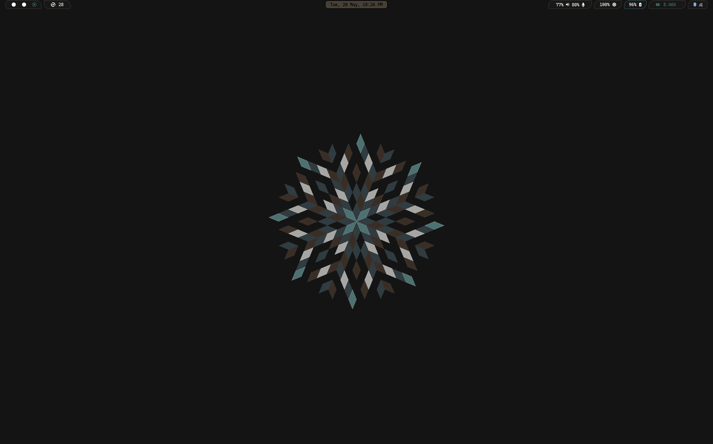

# Niri on Void Linux

Welcome to my custom Niri setup on Void Linux! Niri is a
scrollable-tiling Wayland compositor that arranges windows in columns on
an infinite horizontal strip, inspired by PaperWM. This repository
contains my configuration for Niri, featuring custom window animations,
Waybar for a status bar, and Kitty as the terminal emulator. Below,
you'll find details on the setup, installation instructions, and how to
use the custom animations.



## Features

- **Custom Animations**: Unique window-open and window-close animations:

  - **Drop In from Top**: Windows drop in from above the screen with a
    slight random rotation (up to ±28.6 degrees), creating a dynamic
    entrance.
  - **Fall Off Bottom**: Windows fall downward off the screen with a
    matching rotation, providing a cohesive exit effect.

- **Waybar**: A customizable status bar displaying workspaces, window
  titles, and system information (e.g., clock, network, battery).
  Configured with a clean, minimal design.

- **Kitty Terminal Emulator**: A fast, GPU-based terminal with
  Wayland-native support, bound to Mod+T for quick access.

- **Void Linux Compatibility**: Tailored for Void Linux, using
  xbps-install for package management.

## Screenshot

*Caption*: My Niri desktop on Void Linux, showcasing the Waybar at the
top, Kitty terminal, and the scrollable-tiling layout. The custom
animations are visible when opening/closing windows.

*Note*: To add a screenshot, capture your Niri desktop using grim (e.g.,
grim screenshots/niri_setup.png) or niri msg action screenshot and save
it as screenshots/niri_setup.png in this repository. Update the path if
you use a different filename or location.

## Prerequisites

- **Void Linux**: Ensure you're running a recent Void Linux system with
  Wayland support.

- **Dependencies**:

  - niri: The scrollable-tiling Wayland compositor.
  - waybar: Status bar for workspace and system information.
  - kitty: Terminal emulator with Wayland support.
  - Optional: fuzzel for an application launching.

- **Hardware**: Supports multi-monitor setups, mixed DPI, and NVIDIA
  GPUs. Tested on Void Linux with Wayland-enabled kernels.

## Installation

1.  **Install Niri and Dependencies**:
    ```bash
    sudo xbps-install -S niri waybar kitty grim fuzzel*
    ```
    Niri is available in Void Linux's repositories. If not found, you
    may need to build Niri from source; see the Niri GitHub for
    instructions.

2.  **Clone This Repository**:
    ```bash
    git clone https://github.com/jdpedersen1/niri.git
    git clone https://gitlab.com/jped/niri.git
    ```

3.  **Validate Configuration**:
    
    *niri \--validate*

    If errors occur, check \~/.config/niri/config.kdl for syntax issues

4.  **Log In to Niri**:

    - Use a display manager (e.g., GDM, SDDM) to select the Niri
      session.

    - Alternatively, start Niri from a TTY:

      *niri*

## Configuration

The configuration is stored in \~/.config/niri/config.kdl. Key
components:

### Custom Animations

The animations directory includes the following custom animations:
    - fall
    - circleFadeIn
    - diagonalWipe
    - gentleZoom
    - rippleFade
    - spin-out-close
    - topSlide
    - vortex


### Other Settings
- **Environment**:
  ```kdl
  *environment {*

  * QT_QPA_PLATFORM \"wayland\"*

  * DISPLAY null*

  *}*
  ```
- **Screenshots**: Saved to \~/Pictures/Screenshots/Screenshot from
  %Y-%m-%d %H-%M-%S.png via niri msg action screenshot or using grim.

## Usage

1.  **Launch Niri**: Log in via your display manager or run niri from a
    TTY.

2.  **Test Animations**:

    - Open Kitty: Mod+Shift+Return Watch the window drop in from the top.
    - Close Kitty: Mod+Shift+Q (if bound to close-window). Watch it fall off
      the bottom.
    - Validate config: niri \--validate.

## Contributing

Feel free to fork this repository and submit pull requests for new
animations, Waybar modules, or Kitty configurations. To add a new
animation:

1.  Edit \~/.config/niri/config.kdl with a new window-open or
    window-close block.
2.  Test and submit a PR with your changes.

## Resources

- Niri GitHub
- Niri Wiki
- Waybar Documentation
- Kitty Documentation
- Void Linux Handbook

## License

This configuration is licensed under the GNU License. See LICENSE for
details.
